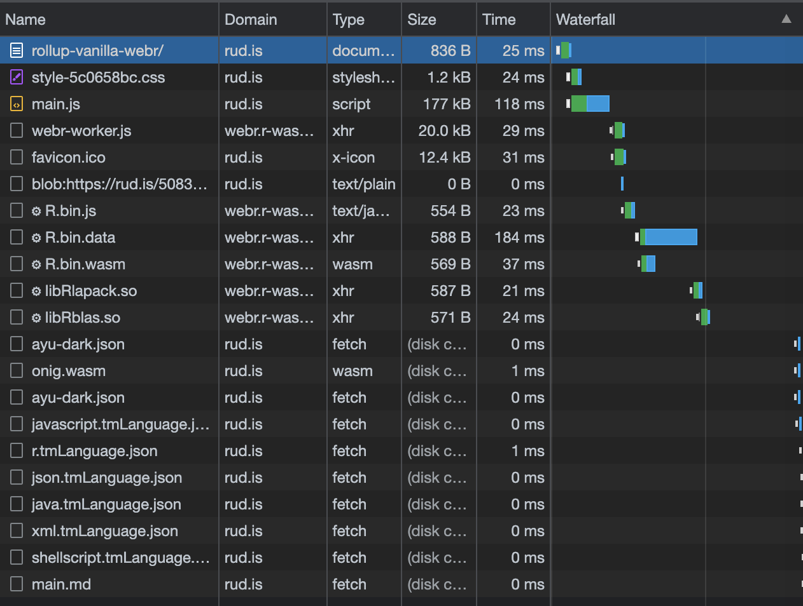

---
{
  "title": "Vanilla JS WebR + Rollup For Smaller & Easier Deploys",
  "og" : {
    "site_name": "WebR Exeriments",
    "url": "https://rud.is/w/rollup-vanilla-webr",
    "description": "Vanilla JS WebR + Rollup For Smaller & Easier Deploys",
    "image": {
      "url": "https://rud.is/w/rollup-vanilla-webr/img/preview.png",
      "height": "768",
      "width": "1536",
      "alt": "Base R bar plot"
    }
  },
  "twitter": {
    "site": "@hrbrmstr",
    "domain": "rud.is"
  }
}
---

# 🧪 Vanilla JS WebR + Rollup For Smaller & Easier Deploys

<status-message id="status"></status-message>

## Going Deeper Into the JavaScript Well

### This is a Lit + WebR + [Observable Plot](https://github.com/observablehq/plot) reproduction of the [OG Shiny Demo App](https://shiny.rstudio.com/gallery/telephones-by-region.html)

<region-plot id="regionsOutput" svgId="lit-regions">
  <select-list label="Select a region:" id="regionsInput"></select-list>
</region-plot>

### Yo Yo Yo!

Vanilla JS is _the best_! Except when it's not.

Even this tiny app of ours is a tad bloated and makes a scandalous number of network connections on first load. Part of that due to us loading entire JS modules when we only need pieces of them. Truth be told, another part is due to me not realizing that including `md` in the list of languages I wanted Shiki (the syntax highlighter) to support included like _every_ language definition b/c ofc it did.

_Anyway…_

In this experiment, we're going to `rollup` our sleeves and tighten things up a bit. We're still staying in unadulterated Vanilla JS land, but we're going to lean on some tooling from the Node.js ecosystem to help our project go on a diet when we deploy it to a real environment.

Before we do that, I feel compelled to go over a couple changes I've made to the previous application to help support this weight reduction program. Here's the updated directory structure with noted about what'd been added or changed; I'll only be covering said changes, so see the previous entries for what everything is for:

```console
rollup-vanilla-webr
├── README.md
├── css
│   └── style.css
├── dist # <--------------------------- This is new!
│   ├── index.browser.mjs
│   └── onig.wasm
├── favicon.ico
├── img
│   └── preview.png
├── index.html # <--------------------- This has been modified.
├── justfile # <----------------------- This has been modified.
├── languages # <---------------------- This is new!
│   ├── css.tmLanguage.json
│   ├── html.tmLanguage.json
│   ├── java.tmLanguage.json
│   ├── javascript.tmLanguage.json
│   ├── json.tmLanguage.json
│   ├── markdown.tmLanguage.json
│   ├── nginx.tmLanguage.json
│   ├── python.tmLanguage.json
│   ├── r.tmLanguage.json
│   ├── shellscript.tmLanguage.json
│   ├── typescript.tmLanguage.json
│   └── xml.tmLanguage.json
├── main.js # <------------------------ This has been modified.
├── md
│   └── main.md
├── package.json # <------------------- This is new!
├── r.js
├── renderers.js # <------------------- This has been modified.
├── rollup.config.js # <--------------- This is new!
├── themes
│   └── ayu-dark.json
├── utils.js
├── wc
│   ├── region-plot.js
│   ├── select-list.js
│   └── status-message.js
├── webr-serviceworker.js.map
└── webr-worker.js.map
```

I finally figured out how to get Shiki loaded as a local ES6 module, which is why there's a `dist/` folder. I did this for many reasons, but one big one was to get it out of `index.html` so we could ship it from wherever we deploy it vs hit the CDN. Shiki is hard coded to use `dist/` and I didn't feel like re-bundling it to be more flexible (I will read up to see if it's configurable when called). The `languages/` and `themes/` folders go with it, and since I figured out why it was loading way too many language support files, I pared those down quite a bit to just what we're using.

We got rid of the Web Components in `index.html` and now load them as modules in `main.js` via:

```js
import "./wc/region-plot.js"
import "./wc/select-list.js"
import "./wc/status-message.js"
```

This enables them to be "rolled up" when we're ready to do so.

In `renderers.js` we now `import` Shiki:

```js
import * as shiki from './dist/index.browser.mjs';
```

Overall, this was just minor surgery, and we'll cover `package.json` in the next section.

### Giving In To Node/npm/npx

To use [Rollup](https://www.rollupjs.org/) we need a JS runtime environment and Node is as good as any since we're just using it to run `rollup`. So, please [install npm](https://nodejs.org/en/download/package-manager) before continuing.

Now, we'll install `npx`, which is just an easier way to run npm JS scripts, then `rollup`, globally to have it around for the future, and then install it local to the project along with some rollup helpers we'll be using.

```console
npm install -g npx
npm install rollup --global 
npm install
```

You now have a `node_modules` directory in the project directory. It's HUGE (yes, I am going to make you scroll past ~140 entries):

```console
node_modules
├── @ampproject
├── @babel
├── @gar
├── @jridgewell
├── @nodelib
├── @npmcli
├── @tootallnate
├── @types
├── @web
├── acorn
├── agent-base
├── agentkeepalive
├── aggregate-error
├── ansi-styles
├── array-union
├── balanced-match
├── brace-expansion
├── braces
├── browserslist
├── buffer-from
├── cacache
├── camel-case
├── caniuse-lite
├── chalk
├── chownr
├── clean-css
├── clean-stack
├── color-convert
├── color-name
├── colorette
├── commander
├── concat-map
├── convert-source-map
├── data-uri-to-buffer
├── debug
├── depd
├── dir-glob
├── dot-case
├── electron-to-chromium
├── encoding
├── err-code
├── escalade
├── escape-string-regexp
├── fast-glob
├── fastq
├── fill-range
├── fs-extra
├── fs-minipass
├── fs.realpath
├── fsevents
├── gensync
├── glob
├── glob-parent
├── globals
├── globby
├── graceful-fs
├── has-flag
├── he
├── html-minifier-terser
├── http-cache-semantics
├── http-proxy-agent
├── https-proxy-agent
├── humanize-ms
├── iconv-lite
├── ignore
├── imurmurhash
├── indent-string
├── infer-owner
├── inflight
├── inherits
├── ip
├── is-extglob
├── is-glob
├── is-lambda
├── is-number
├── is-plain-object
├── js-tokens
├── jsesc
├── json5
├── jsonfile
├── lower-case
├── lru-cache
├── make-fetch-happen
├── merge2
├── micromatch
├── mime-db
├── mime-types
├── minimatch
├── minipass
├── minipass-collect
├── minipass-fetch
├── minipass-flush
├── minipass-pipeline
├── minipass-sized
├── minizlib
├── mkdirp
├── ms
├── negotiator
├── no-case
├── node-releases
├── once
├── p-map
├── param-case
├── parse5
├── pascal-case
├── path-is-absolute
├── path-type
├── picocolors
├── picomatch
├── promise-inflight
├── promise-retry
├── queue-microtask
├── relateurl
├── retry
├── reusify
├── rimraf
├── rollup
├── rollup-plugin-copy
├── rollup-plugin-url-resolve
├── run-parallel
├── safer-buffer
├── semver
├── slash
├── smart-buffer
├── socks
├── socks-proxy-agent
├── source-map
├── source-map-support
├── ssri
├── supports-color
├── tar
├── terser
├── to-fast-properties
├── to-regex-range
├── tslib
├── unique-filename
├── unique-slug
├── universalify
├── update-browserslist-db
├── wrappy
└── yallist
```

May I never complain about the {tidyverse} dependency Hades ever again.

We're now ready to roll things up.

### Rollup Time!

The last "new" file is `rollup.config.js`. Think of this like a "justfile" or "Makefile" with some extra bits tacked on. It's just instructions for how we want to get our project put into a better format for serving in production:

```js
// this is what were using from what we put into `package.json`
import urlResolve from 'rollup-plugin-url-resolve';
import { rollupPluginHTML as html } from '@web/rollup-plugin-html';
import copy from 'rollup-plugin-copy';

export default [
  {
    
    input: './main.js', // rollup will inspect this 
                        // and the entire tree of imports it relies on
    output: {
      dir: 'build',     // We're putting all the output files/dirs here
      format: 'es'      // And we still want ES6 modules
    },
    
    plugins: [
      urlResolve({ // 👈🏼 see below the code
        cacheManager: '.cache',
        minify: true,
      }),
      html({ // 👈🏼 see below the code
        input: 'index.html',
        minify: true,
      }),
      copy({ // 👈🏼 see below the code
        targets: [
          { src: 'dist/onig.wasm', dest: 'build/dist' },
          { src: 'md/**/*', dest: 'build/md' },
          { src: 'languages/**/*', dest: 'build/languages' },
          { src: 'themes/**/*', dest: 'build/themes' },
          { src: 'img/**/*', dest: 'build/img' },
          { src: '*.map', dest: 'build' },
          { src: 'favicon.ico', dest: 'build' },
        ]
      })
    ]
    
  }
];
```

Plain ol' `rollup` will just care about the JS dependencies. If we have extra bits we need to put into the `build` directory, we have to tell it to do that. One way is to use that "`copy`" plugin and specify stuff by hand. For small projects like these, that's 100% fine. 

The `html` plugin will also figure out things to add from our `index.html` (like the CSS file). It would have handled the `<script>` tags, too, but it would have kept us relying on a CDN for Shiki. Blech.

`urlResolve` lets me me lazy and still rely on CDNs during development. It'll fetch and `.cache` those resources so they can be further scrunched, [shaken](https://www.rollupjs.org/introduction/#tree-shaking) and come along for the ride from _our_ server.

The `justfile` has been changed to give us a "rollup" job:

```console
rollup:
  rm -rf build/
  npx rollup --config # use the default config file
```
After a `just rollup` we have a new `build/` directory!

```console
build
├── assets
│   └── style-5c0658bc.css
├── dist
│   └── onig.wasm
├── favicon.ico
├── img
│   └── preview.png
├── index.html
├── languages
│   ├── css.tmLanguage.json
│   ├── html.tmLanguage.json
│   ├── java.tmLanguage.json
│   ├── javascript.tmLanguage.json
│   ├── json.tmLanguage.json
│   ├── markdown.tmLanguage.json
│   ├── nginx.tmLanguage.json
│   ├── python.tmLanguage.json
│   ├── r.tmLanguage.json
│   ├── shellscript.tmLanguage.json
│   ├── typescript.tmLanguage.json
│   └── xml.tmLanguage.json
├── main.js
├── md
│   └── main.md
├── themes
│   └── ayu-dark.json
├── webr-serviceworker.js.map
└── webr-worker.js.map
```

You should poke at `main.js` and `index.html` to see how mangled they are.

The `rsync` `just` job is now `rsync -avp ./build/ rud.is:~/rud.is/w/rollup-vanilla-webr/`: it is literally how i deployed what you're seeing.

### Proving It's Better

`https://rud.is/w/lit-webr-plot/` makes over 80 HTTP requests, with most hitting the jsdelivr CDN. The Network tab of DevTools scrolls too much to see it. 

Here's what our reduced version does (just over 20):



### FIN

We are by no means finished with optimizing things, but this "rollup" thing can be a bit intimidating for folks who aren't JS natives.

Hit up GH: <https://github.com/hrbrmstr/rollup-vanilla-webr> for the source and drop any issues if anything needs more explanation.

<p style="text-align:center;margin-top:2rem;">Brought to you by @hrbrmstr</p>
